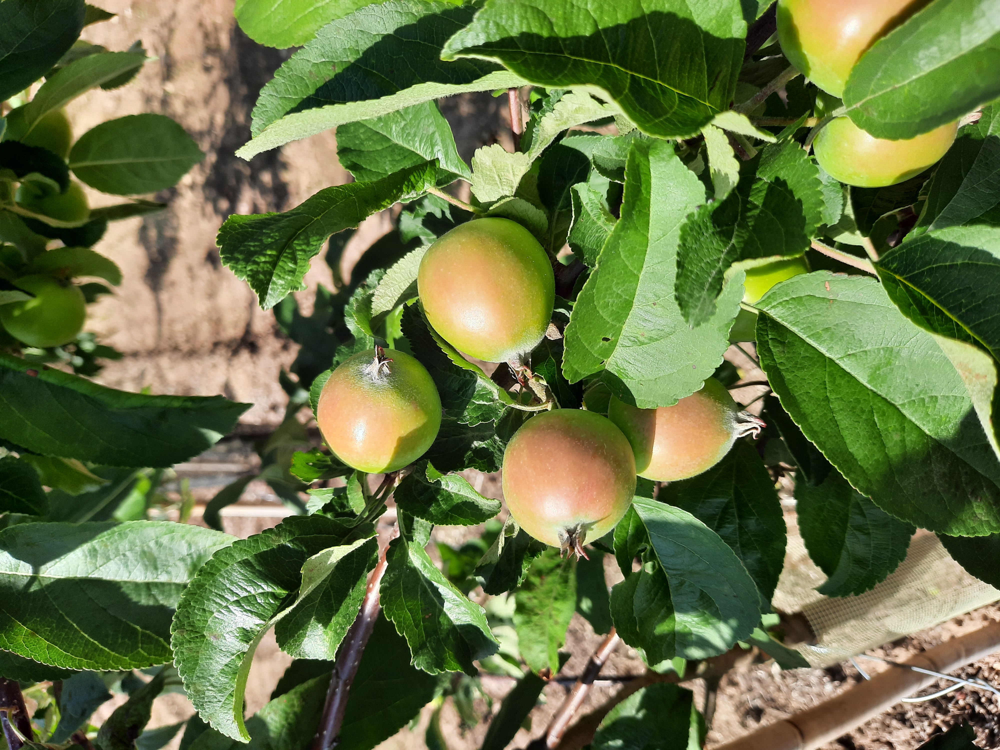

# AppleScabFDs

[](#citation)
[](https://creativecommons.org/licenses/by/4.0/)
[](#changelog)

Images of apple leaves/fruits labeled for scab presence. Photos were collected in orchards across Latvia under varied lighting conditions. This folder now follows the standardized layout used by `AppleBBCH81`.

- Project page: `https://www.kaggle.com/datasets/projectlzp201910094/applescabfds`
- Issue tracker: use this repo

## TL;DR
- Task: classification (two classes: `healthy`, `scab`)
- Modality: RGB
- Platform: handheld/field
- Real/Synthetic: real
- Images: ~hundreds (see counts)
- Classes: 2
- Resolution: various
- Annotations: COCO JSON (image-level via full-image boxes)
- License: CC BY 4.0 (see License)
- Citation: see below

## Table of contents
- [Download](#download)
- [Dataset structure](#dataset-structure)
- [Sample images](#sample-images)
- [Annotation schema](#annotation-schema)
- [Stats and splits](#stats-and-splits)
- [Quick start](#quick-start)
- [Evaluation and baselines](#evaluation-and-baselines)
- [Datasheet (data card)](#datasheet-data-card)
- [Known issues and caveats](#known-issues-and-caveats)
- [License](#license)
- [Citation](#citation)
- [Changelog](#changelog)
- [Contact](#contact)

## Download
- Original dataset: `https://www.kaggle.com/datasets/projectlzp201910094/applescabfds`
- This repo hosts structure and conversion scripts only; place the downloaded folders under this directory.
- Local license file: see `LICENSE` (Creative Commons Attribution 4.0).

## Dataset structure

This dataset follows the standardized dataset structure specification with subcategory organization:

```
AppleScabFDs/
├── apples/
│   ├── healthy/              # Healthy apple images
│   │   ├── csv/              # CSV annotations per image
│   │   ├── json/             # Original JSON annotations
│   │   ├── images/           # Healthy images
│   │   └── segmentations/    # (empty, no segmentation masks)
│   ├── scab/                 # Scab-infected apple images
│   │   ├── csv/              # CSV annotations per image
│   │   ├── json/             # Original JSON annotations
│   │   ├── images/           # Scab images
│   │   └── segmentations/    # (empty, no segmentation masks)
│   ├── labelmap.json        # Label mapping (healthy=1, scab=2)
│   └── sets/                 # Dataset splits
│       ├── train.txt
│       ├── val.txt
│       ├── test.txt
│       ├── all.txt
│       └── train_val.txt
├── annotations/              # COCO format JSON (generated)
│   ├── apples_instances_train.json
│   ├── apples_instances_val.json
│   └── apples_instances_test.json
├── scripts/
│   ├── standardize.py       # Standardization script
│   └── convert_to_coco.py   # COCO conversion script
├── LICENSE
├── README.md
└── requirements.txt
```

- Splits: `apples/sets/train.txt`, `apples/sets/val.txt`, `apples/sets/test.txt` (and also `all.txt`, `train_val.txt`) list image paths (format: `{subcategory}/{image_name}`). If missing, all images are used.

## Sample images

Below are example images for each category in this dataset. Paths are relative to this README location.

<table>
  <tr>
    <th>Category</th>
    <th>Sample</th>
  </tr>
  <tr>
    <td><strong>Healthy</strong></td>
    <td>
      
      <div align="center"><code>apples/healthy/images/20200714_162002.jpg</code></div>
    </td>
  </tr>
  <tr>
    <td><strong>Scab</strong></td>
    <td>
      
      <div align="center"><code>apples/scab/images/20200714_161827.jpg</code></div>
    </td>
  </tr>
</table>

## Annotation schema
- CSV per-image schemas (stored under each subcategory's `csv/` folder):
  - Classification task: columns include `item, x, y, width, height, label` (full-image bounding box: `[0, 0, image_width, image_height]`).
- COCO-style (generated):
```json
{
  "info": {"year": 2021, "version": "1.0.0", "description": "AppleScabFDs apples train split", "url": "https://www.kaggle.com/datasets/projectlzp201910094/applescabfds"},
  "images": [{"id": 1, "file_name": "apples/healthy/images/IMG_0001.jpg", "width": 3648, "height": 2736}],
  "categories": [{"id": 1, "name": "healthy", "supercategory": "apple_scab"}, {"id": 2, "name": "scab", "supercategory": "apple_scab"}],
  "annotations": [{"id": 10, "image_id": 1, "category_id": 1, "bbox": [0, 0, 3648, 2736], "area": 9980928, "iscrowd": 0}]
}
```

- Label maps: `apples/labelmap.json` defines the category mapping; the provided converter normalizes to 2 categories (healthy=1, scab=2).

## Stats and splits
- Total images: 297
  - Healthy: 90 images
  - Scab: 207 images
- Training set: 207 images (207 annotations) (`apples/sets/train.txt`)
- Validation set: 44 images (44 annotations) (`apples/sets/val.txt`)
- Test set: 46 images (46 annotations) (`apples/sets/test.txt`)
- Classes: 2 (healthy=1, scab=2)
- Splits provided via `apples/sets/*.txt`. You may define your own splits by editing those files.

## Quick start
Python (COCO):
```python
from pycocotools.coco import COCO
coco = COCO("annotations/apples_instances_train.json")
img_ids = coco.getImgIds()
img = coco.loadImgs(img_ids[0])[0]
ann_ids = coco.getAnnIds(imgIds=img['id'])
anns = coco.loadAnns(ann_ids)
```
Convert CSV to COCO JSON:
```bash
python scripts/convert_to_coco.py --root . --out annotations --categories apples --splits train val test
```

Dependencies:
```bash
python -m pip install pillow
```
Optional for the COCO API example:
```bash
python -m pip install pycocotools
```

## Evaluation and baselines
- Metric: Accuracy for classification; report F1 for historical comparison if desired.
- Reference results: See citation paper for baseline results using CNN and transfer learning.

## Datasheet (data card)
- Motivation: apple scab presence classification to help identify diseased apple leaves/fruits.
- Composition: RGB images of apple leaves/fruits; 2 classes (healthy, scab).
- Collection process: Photos collected in orchards across Latvia under varied lighting conditions; field images at various times of day and lighting.
- Preprocessing: none required; COCO JSON produced by script.
- Distribution: data hosted on Kaggle; this repo provides ancillary scripts and standardized structure.
- Maintenance: community contributions via issue tracker.

## Known issues and caveats
- Classification task: This is a classification dataset. Each image has a full-image bounding box annotation indicating its class (healthy or scab).
- Data quality note: Some images in the dataset may not match the expected content (e.g., may contain images of other fruits). Please verify image content before use. The dataset structure has been standardized, but the original image content is preserved as-is from the source dataset.
- Coordinates are in pixel units with origin at the image top-left. Ensure downstream tooling expects absolute COCO boxes.

## License
- Creative Commons Attribution 4.0 (`LICENSE`). Check the original dataset terms and cite appropriately.

## Citation
```bibtex
@article{kodors2021apple,
  title={Apple Scab Detection using CNN and Transfer Learning},
  author={Kodors, S. and Lacis, G. and Sokolova, O. and Zhukovs, V. and Apeinans, I. and Bartulsons, T.},
  journal={Agronomy Research},
  volume={19},
  number={2},
  pages={507--519},
  year={2021},
  doi={10.15159/AR.21.045}
}
```

## Changelog
- V1.0.0: initial standardized structure and COCO conversion utility

## Contact
- Maintainers: Open to contributions via issue tracker.
- Original authors: Kodors, S.; Lacis, G.; Sokolova, O.; Zhukovs, V.; Apeinans, I.; Bartulsons, T.
- Source: `https://www.kaggle.com/datasets/projectlzp201910094/applescabfds`