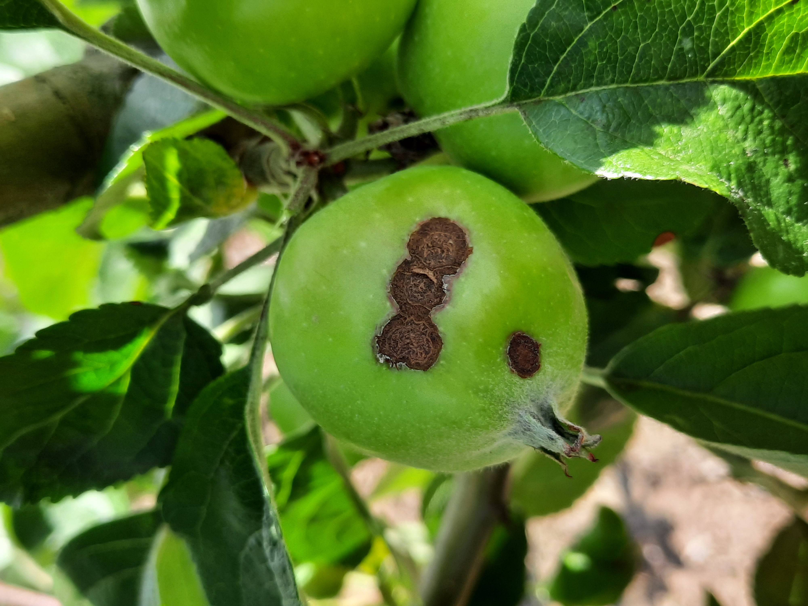

# AppleScabFDs

[](#citation)
[](https://creativecommons.org/licenses/by/4.0/)
[](#changelog)

Images of apple leaves/fruits labeled for scab presence. Photos were collected in orchards across Latvia under varied lighting conditions. This folder now follows the standardized layout used by `AppleBBCH81`.

- Project page: `https://www.kaggle.com/datasets/projectlzp201910094/applescabfds`
- Issue tracker: use this repo

## TL;DR
- Task: classification (two classes: `healthy`, `scab`)
- Modality: RGB
- Platform: handheld/field
- Real/Synthetic: real
- Images: ~hundreds (see counts)
- Classes: 2
- Resolution: various
- Annotations: COCO JSON (image-level via full-image boxes)
- License: CC BY 4.0 (see License)
- Citation: see below

## What's inside
- [Download](#download)
- [Dataset structure](#dataset-structure)
- [Sample images](#sample-images)
- [Annotation schema](#annotation-schema)
- [Stats and splits](#stats-and-splits)
- [Quick start](#quick-start)
- [Datasheet (data card)](#datasheet-data-card)
- [Known issues and caveats](#known-issues-and-caveats)
- [License](#license)
- [Citation](#citation)
- [Changelog](#changelog)
- [Contact](#contact)

## Download
- Images: this folder (`Healthy/`, `Scab/`)
- Annotations (COCO): produced with `scripts/convert_to_coco.py` into `annotations/` (md5: `pending`)

## Dataset structure
```
datasets/AppleScabFDs/
├── Healthy/                 # class folder (images)
├── Scab/                    # class folder (images)
├── annotations/             # COCO JSON exports
├── scripts/                 # utilities
│   ├── convert_to_coco.py
│   └── generate_splits.py
├── sets/                    # split lists (train/val/test/all)
├── requirements.txt
└── README.md
```
- Splits: `sets/train.txt`, `sets/val.txt`, `sets/test.txt`, `sets/all.txt`

## Sample images
<table>
  <tr>
    <th>Sample</th>
    <th>Image</th>
  </tr>
  <tr>
    <td><strong>Healthy</strong></td>
    <td>
      
      <div align="center"><code>Healthy/20200714_162002.jpg</code></div>
    </td>
  </tr>
  <tr>
    <td><strong>Scab</strong></td>
    <td>
      
      <div align="center"><code>Scab/20200714_161827.jpg</code></div>
    </td>
  </tr>
</table>

## Annotation schema
- COCO-style (classification as full-image box):
```json
{
  "info": {"year": 2024, "version": "1.0.0", "description": "AppleScabFDs", "url": "https://www.kaggle.com/datasets/projectlzp201910094/applescabfds"},
  "images": [{"id": 1, "file_name": "Healthy/xxx.jpg", "width": 1000, "height": 750}],
  "categories": [
    {"id": 1, "name": "healthy", "supercategory": "applescabfds"},
    {"id": 2, "name": "scab", "supercategory": "applescabfds"}
  ],
  "annotations": [
    {"id": 10, "image_id": 1, "category_id": 1, "bbox": [0,0,1000,750], "area": 750000, "iscrowd": 0}
  ]
}
```

## Stats and splits
- Use `scripts/generate_splits.py` to create `train/val/test` lists. The split is stratified by class.

## Quick start
Python (COCO):
```python
from pycocotools.coco import COCO
coco = COCO("annotations/applescabfds_instances_train.json")
img_ids = coco.getImgIds()
img = coco.loadImgs(img_ids[0])[0]
ann_ids = coco.getAnnIds(imgIds=img['id'])
anns = coco.loadAnns(ann_ids)
```

## Datasheet (data card)
- Motivation: apple scab presence classification
- Composition: 2 classes (`healthy`, `scab`)
- Collection process: field images at various times of day and lighting
- Preprocessing: none required; COCO JSON produced by script
- Distribution: open; see License
- Maintenance: community-maintained

## Known issues and caveats
- This dataset has no object-level boxes. COCO export uses a single full-image box per image to carry class labels for downstream tooling.

## License
- CC BY 4.0. See `LICENSE` in this folder.

## Citation
```
Kodors, S., Lacis, G., Sokolova, O., Zhukovs, V., Apeinans, I., & Bartulsons, T. (2021). Apple Scab Detection using CNN and Transfer Learning. Agronomy Research, 19(2), 507–519. doi: 10.15159/AR.21.045
```

## Changelog
- V1.0.0: standardized layout, split generator, and COCO converter (2025-08-12)

## Contact
- Maintainer(s): community
- Issues: this repo